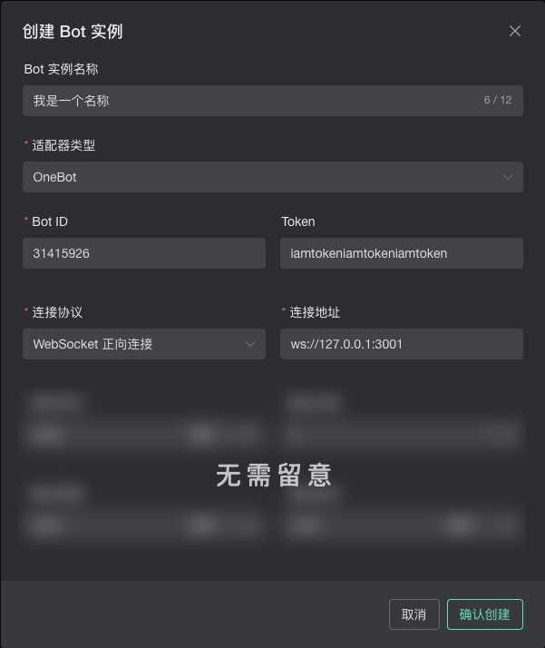

import { Step, Steps } from "fumadocs-ui/components/steps";

首先，确保你已经下载并配置好了 Lagrange.OneBot：

<Card title="Lagrange.OneBot 官方文档" href="https://lagrangedev.github.io/Lagrange.Doc/v1/Lagrange.OneBot/Config/" />

并且已完成 QQ 账号的扫码登录。

## 方法 1：配置 Lagrange.OneBot 的正向 WebSocket

架构上推荐的做法（可即时主动连接到 Lagrange.OneBot），FlowGate Nexus 连接到 Lagrange.OneBot 提供的 WebSocket 服务器接口，适合 Lagrange.OneBot 部署在公网或内网可被 Nexus 访问到的情况。

<Steps>
  <Step>
    ### 配置正向 WebSocket

    首次运行 `Lagrange.OneBot.exe`，程序会在同级目录下自动生成默认的 `appsettings.json` 配置文件。

    打开 `appsettings.json`，在 `Implementations` 数组中添加或修改为正向 WebSocket 配置：

    ```json
    {
      "Type": "ForwardWebSocket",
      "Host": "127.0.0.1",
      "Port": 3001,
      "HeartBeatInterval": 5000,
      "HeartBeatEnable": true,
      "AccessToken": ""
    }
    ```

    各字段说明：
    - **Host**：本地部署填 `127.0.0.1`；需要外部访问时填 `0.0.0.0`
    - **Port**：监听端口，如 `3001`，可自行修改
    - **AccessToken**：访问令牌，可自定义字符串或留空。**请记住此值**，后续在 FlowGate Nexus 中配置时需要填入。

    注意：配置文件中以 `//` 开头的为注释，复制到实际配置文件时务必删除。

  </Step>
  <Step>
    ### 配置账号信息

    配置 `Account` 部分，将 `Uin` 填入机器人的 QQ 号（用于识别登录文件），`Protocol` 保持 `"Linux"` 即可：

    ```json
    "Account": {
      "Uin": 0,
      "Password": "",
      "Protocol": "Linux",
      "AutoReconnect": true,
      "GetOptimumServer": true
    }
    ```

  </Step>
  <Step>
    ### 运行并扫码登录

    保存配置文件后，重新运行 Lagrange.OneBot。首次运行会在同级目录生成登录二维码图片 `qr-0.png`，使用手机 QQ 扫码登录（推荐勾选「下次登录无需确认」）。

    登录成功后，Lagrange.OneBot 会开始监听配置的端口。

  </Step>
  <Step>
    ### 创建 Bot 实例

    打开 FlowGate Nexus 的管理界面，进入 **Bot 实例** 页面，点击 **创建新 Bot 实例**。

    在弹出的表单中，填入 Bot 实例的名称（可选，用于备注）。在 **适配器类型** 下拉菜单中选择 **OneBot**。
    

  </Step>
  <Step>
    ### 配置 Bot 实例

    在 Bot 实例的配置表单中，完成以下填写：

    - **Bot ID**：填入 Lagrange.OneBot 所登录的 QQ 账号
    - **Token**：填入 `appsettings.json` 中设置的 `AccessToken`（若留空则不填）
    - **连接协议**：选择 **正向连接**
    - **连接地址**：填入 Lagrange.OneBot 正向 WebSocket 的地址，格式如下：

      ```txt
      ws://{IP}:{端口}
      ```

      例如本地部署、端口为 `3001` 时，填入 `ws://127.0.0.1:3001`。

    其他高级选项新手保持默认即可，完成后保存。

    ---

    例子（仅演示用请勿复制使用）：
    - 机器人账号：31415926
    - Token：iamtokeniamtokeniamtoken
    - 连接地址：ws://127.0.0.1:3001

    

  </Step>
  <Step>
    ### 确认创建

    点击 **确认创建** 后，FlowGate Nexus 的 Koishi 服务会尝试连接 Lagrange.OneBot 的 WebSocket 服务器接口，如果配置正确，则 FlowGate Nexus 对应实例会显示为在线状态。

  </Step>
</Steps>

大功告成！

## 方法 2：配置 Lagrange.OneBot 的反向 WebSocket

意思为 Lagrange.OneBot 主动连接到 FlowGate Nexus 提供的 WebSocket 服务器接口，适合 Lagrange.OneBot 部署在内网无法被 Nexus 访问到的情况。

<Steps>
  <Step>
    ### 创建 Bot 实例

    打开 FlowGate Nexus 的管理界面，进入 **Bot 实例** 页面，点击 **创建新 Bot 实例**。

    在弹出的表单中，填入 Bot 实例的名称（可选，用于备注）。在 **适配器类型** 下拉菜单中选择 **OneBot**。
    

  </Step>
  <Step>
    ### 配置 Bot 实例

    在 Bot 实例的配置表单中，完成以下填写：

    - **Bot ID**：填入 Lagrange.OneBot 所登录的 QQ 账号
    - **Token**：可自定义或留空。**请记住此 Token**，后续在 Lagrange.OneBot 中需要填入相同的值，用于验证连接身份。
    - **连接协议**：选择 **WebSocket 反向连接**
    - **路径**：填入一个路径，如 `/onebot`

    其他高级选项新手保持默认即可，完成后保存。

    ---

    例子（仅演示用请勿复制使用）：
    - 机器人账号：31415926
    - Token：iamtokeniamtokeniamtoken
    - 路径：/onebot

    

  </Step>
  <Step>
    ### 确认创建并记录地址

    点击 **确认创建** 后，FlowGate Nexus 会启动一个 WebSocket 服务器接口等待连接，地址格式为：

    ```txt
    ws://{Koishi 地址}:{Koishi 端口}/{路径}
    ```

    例如本地部署、路径填 `/onebot` 时，地址为 `ws://127.0.0.1:5140/onebot`。**请记录此地址**，下一步配置 Lagrange.OneBot 时需要填入。

  </Step>
  <Step>
    ### 配置反向 WebSocket

    打开 Lagrange.OneBot 的 `appsettings.json`，在 `Implementations` 数组中添加或修改为反向 WebSocket 配置：

    ```json
    {
      "Type": "ReverseWebSocket",
      "Host": "127.0.0.1",
      "Port": 5140,
      "Suffix": "/onebot",
      "ReconnectInterval": 5000,
      "HeartBeatInterval": 5000,
      "HeartBeatEnable": true,
      "AccessToken": ""
    }
    ```

    各字段说明：
    - **Host**：填入 FlowGate Nexus 所在的 IP 地址，本地部署填 `127.0.0.1`
    - **Port**：填入 FlowGate Nexus（Koishi）的端口，默认为 `5140`
    - **Suffix**：填入上一步中设置的路径，如 `/onebot`
    - **AccessToken**：填入在 FlowGate Nexus 中设置的 Token（若留空则不填）

    注意：配置文件中以 `//` 开头的为注释，复制到实际配置文件时务必删除。

  </Step>
  <Step>
    ### 启动 Lagrange.OneBot

    保存配置文件后，启动（或重启）Lagrange.OneBot。Lagrange.OneBot 会主动连接到 FlowGate Nexus 的 Koishi 服务接口，如果配置正确，则 FlowGate Nexus 对应实例会显示为在线状态。

  </Step>
</Steps>

大功告成！
