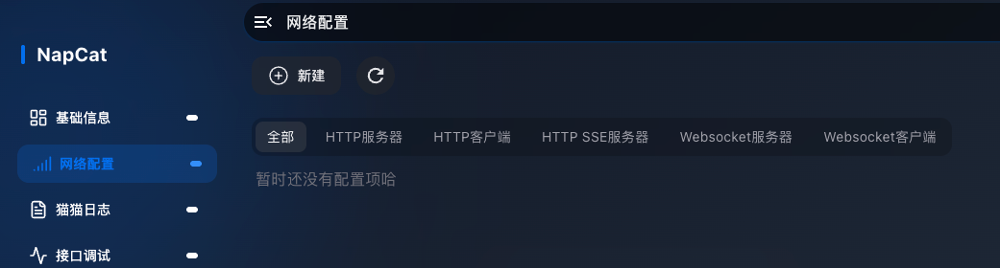
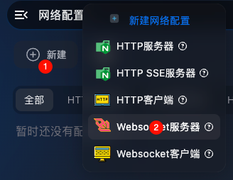
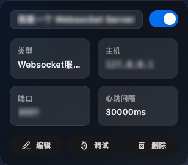
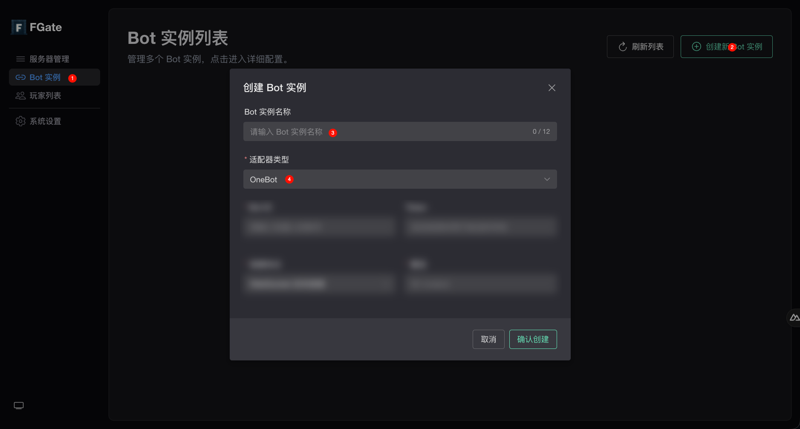
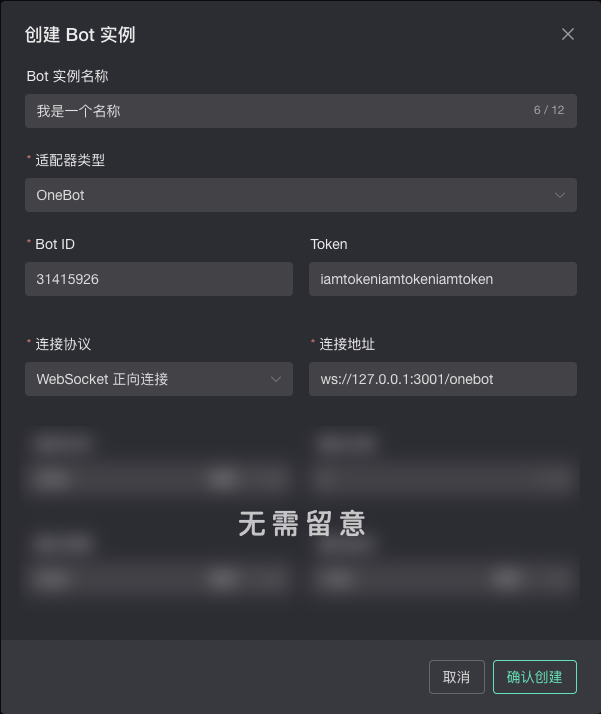
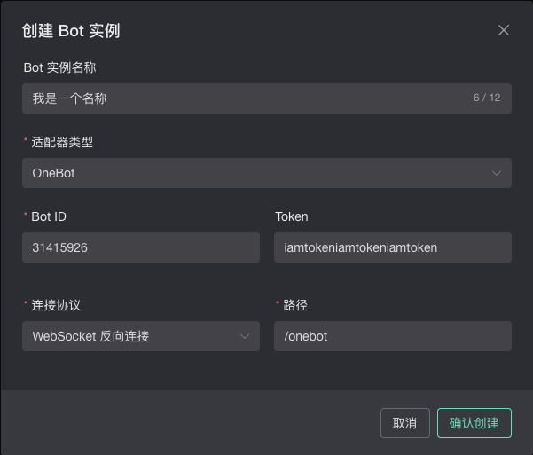
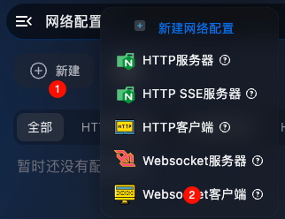

import { Step, Steps } from "fumadocs-ui/components/steps";
import { ImageZoom } from "fumadocs-ui/components/image-zoom";

首先，确保你已经安装了 NapCat：

<Card title="NapCat 安装教程" href="https://napneko.github.io/guide/boot/Shell" />

并且已链接好你的 QQ 机器人账号。

## 方法 1：配置 NapCat 的 Websocket 服务器

架构上推荐的做法（可即时主动连接到 NapCat），FlowGate Nexus 连接到 NapCat 提供的 Websocket 服务器接口，适合 NapCat 部署在公网或内网可被 Nexus 访问到的情况

<Steps>
  <Step>
    ### 打开 NapCat 网络配置

    打开 NapCat 的 WebUI 后台管理界面，进入 **网络配置** 页面。
    

  </Step>
  <Step>
    ### 新建 Websocket 服务器

    点击新建按钮，选择 **Websocket 服务器**
    

  </Step>
  <Step>
    ### 填写服务器配置

    在配置页面中完成以下配置：

    - **启用开关**：打开
    - **名称**：随意填写
    - **Host**：本地部署填入 `127.0.0.1`；公网部署填入 `0.0.0.0` 或公网 IP
    - **端口**：随意填写（如 `3001`）
    - **Token**：NapCat 会自动生成一个 Token，也可以留空不使用，但建议保留或自定义一个。**请记住此 Token**，后续在 FlowGate 中配置 OneBot 适配器连接时需要填入，用于验证连接身份。

    其他选项保持默认即可。

    图就不放了，会有误导性的截图，毕竟版本更新迭代比较快，界面可能会有较大变化。

  </Step>
  <Step>
    ### 保存并启用

    配置完成后点击保存，确保 Websocket 服务器已启用并正在运行。
    

  </Step>
  <Step>
    ### 创建 Bot 实例

    打开 FlowGate Nexus 的管理界面，进入 **Bot 实例** 页面，点击 **创建新 Bot 实例**。

    在弹出的表单中，填入 Bot 实例的名称（可选，用于备注）。在 **适配器类型** 下拉菜单中选择 **OneBot**。
    

  </Step>
  <Step>
    ### 配置 Bot 实例

    在 Bot 实例的配置表单中，完成以下填写：

    - **Bot ID**：填入 NapCat 所登录的 QQ 账号
    - **Token**：填入上一步中记住的 Token（若留空则不填）
    - **连接协议**：选择 **正向连接**
    - **连接地址**：填入 NapCat Websocket 服务器的地址，并在末尾加上 `/onebot`，格式如下：

      ```txt
      ws://{IP}:{端口}/onebot
      ```

      例如本地部署则填入 `ws://127.0.0.1:3001/onebot`。

    其他高级选项新手保持默认即可，完成后保存。

    ---

    例子（仅演示用请勿复制使用）：
    - 机器人账号：31415926
    - Token：iamtokeniamtokeniamtoken
    - 连接地址：ws://127.0.0.1:3001/onebot

    

  </Step>
  <Step>
    ### 确认创建

    点击 **确认创建** 后，FlowGate Nexus 的 Koishi 服务会尝试连接 NapCat 的 Websocket 服务器接口，如果配置正确，则 FlowGate Nexus 对应实例会显示为在线状态。

  </Step>
</Steps>

大功告成！

## 方法 2：配置 NapCat 的 Websocket 客户端

意思为 NapCat 主动连接到 FlowGate Nexus 提供的 WebSocket 服务器接口，适合 NapCat 部署在内网无法被 Nexus 访问到的情况。

<Steps>
  <Step>
    ### 创建 Bot 实例

    打开 FlowGate Nexus 的管理界面，进入 **Bot 实例** 页面，点击 **创建新 Bot 实例**。

    在弹出的表单中，填入 Bot 实例的名称（可选，用于备注）。在 **适配器类型** 下拉菜单中选择 **OneBot**。
    

  </Step>
  <Step>
    ### 配置 Bot 实例

    在 Bot 实例的配置表单中，完成以下填写：

    - **Bot ID**：填入 NapCat 所登录的 QQ 账号
    - **Token**：可自定义或留空。**请记住此 Token**，后续在 NapCat 中需要填入相同的值，用于验证连接身份。
    - **连接协议**：选择 **WebSocket 反向连接**
    - **路径**：填入一个路径，如 `/onebot`

    其他高级选项新手保持默认即可，完成后保存。

    ---

    例子（仅演示用请勿复制使用）：
    - 机器人账号：31415926
    - Token：iamtokeniamtokeniamtoken
    - 路径：/onebot

    

  </Step>
  <Step>
    ### 确认创建并记录地址

    点击 **确认创建** 后，FlowGate Nexus 会启动一个 WebSocket 服务器接口等待连接，地址格式为：

    ```txt
    ws://{Koishi 地址}:{Koishi 端口}/{路径}
    ```

    例如本地部署、路径填 `/onebot` 时，地址为 `ws://127.0.0.1:5140/onebot`。**请记录此地址**，下一步配置 NapCat 时需要填入。

  </Step>
  <Step>
    ### 打开 NapCat 网络配置

    打开 NapCat 的 WebUI 后台管理界面，进入 **网络配置** 页面。
    

  </Step>
  <Step>
    ### 新建 Websocket 客户端

    点击新建按钮，选择 **Websocket 客户端**
    

  </Step>
  <Step>
    ### 填写客户端配置

    在配置页面中完成以下配置：

    - **启用开关**：打开
    - **名称**：随意填写
    - **URL**：填入上一步中记录的完整 WebSocket 地址，例如 `ws://127.0.0.1:5140/onebot`
    - **Token**：填入在 FlowGate Nexus 中设置的 Token（若留空则不填）

    其他选项保持默认即可。

    图就不放了，会有误导性的截图，毕竟版本更新迭代比较快，界面可能会有较大变化。

  </Step>
  <Step>
    ### 确认创建

    点击 **确认创建** 后，确保 Websocket 客户端已启用。NapCat 会主动连接到 FlowGate Nexus 的 Koishi 服务接口，如果配置正确，则 FlowGate Nexus 对应实例会显示为在线状态。

  </Step>
</Steps>

大功告成！
