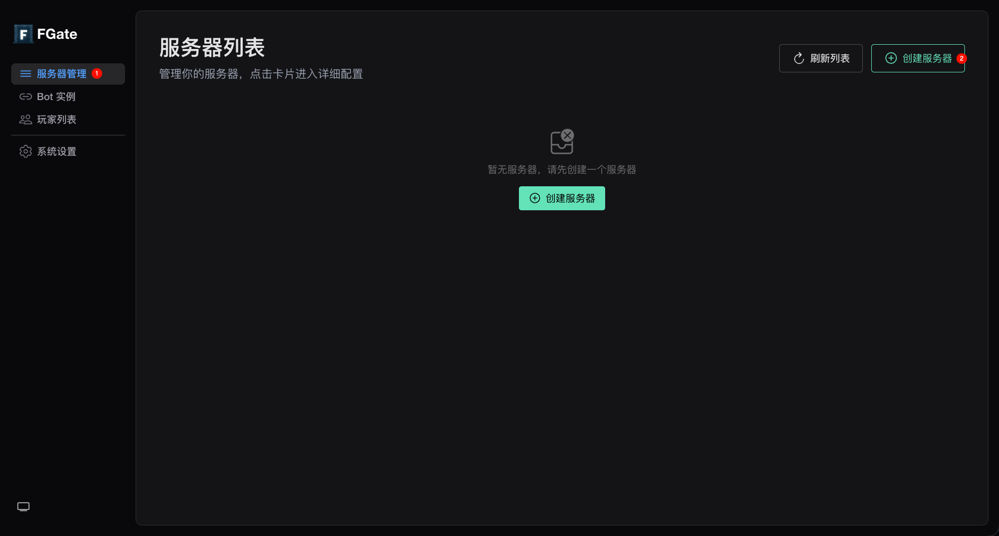
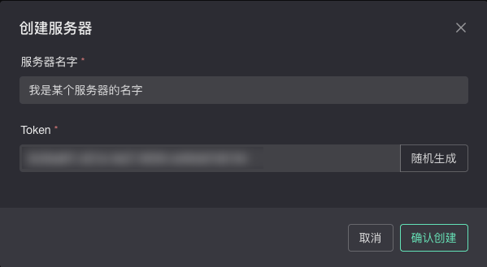

import { Step, Steps } from "fumadocs-ui/components/steps";

## 前提条件

- 已部署并运行的 FlowGate Nexus 实例

<Steps>
  <Step>
    ### 访问 Nexus 管理界面

    打开浏览器，访问你的 FlowGate Nexus 实例地址，进入管理界面。

  </Step>
  <Step>
    ### 创建服务器实例

    在 **服务器管理** 页面，点击 **创建服务器** 按钮，弹出创建表单。

    

  </Step>
  <Step>
    ### 填写服务器信息

    在创建表单中，完成以下填写：

    - **服务器名称**：随意填写，用于区分不同服务器实例
    - **Token**：必须填写，表单会自动生成一个随机 Token，你也可以自定义一个。**请记住此 Token**，后续在 Client 端配置连接时需要填入，用于验证连接身份。

    

  </Step>
  <Step>
    ### 创建

    填写完成后点击 **确认创建**，你将看到新创建的服务器实例出现在列表中，状态为 **离线**。

  </Step>
</Steps>

进入下一章，我们将部署 Client 端插件，并将其连接到这个服务器实例，实现 Minecraft 服务器与 Nexus 的桥接。
